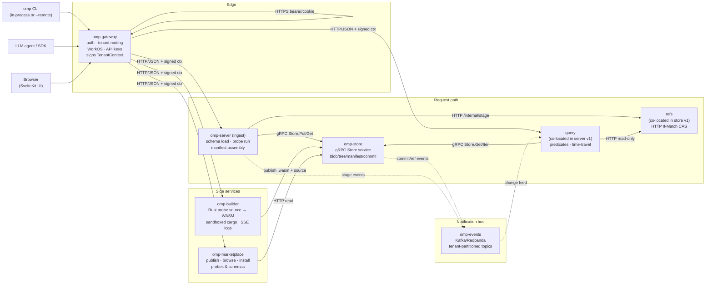
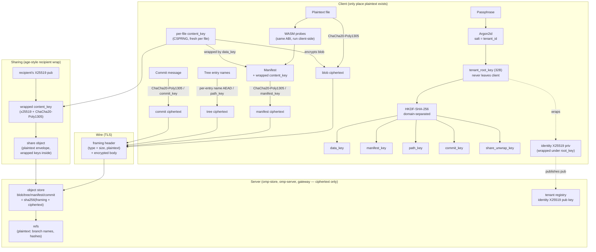

# OpenMemoryProtocol

A Git-like content store for files an LLM agent works with.

- Every user file is stored as **blob + manifest**. Manifest fields are declared by a **schema** (TOML), populated by **probes** (WASM modules), and committed alongside the file as content-addressed objects.
- **Schemas and probes live in the tree.** Adding a file type = committing a schema; adding extraction logic = committing a probe. No OMP release required.
- **Time-travel is free.** Every manifest records the `schema_hash` and the `probe_hashes` that produced it. `omp show <path> --at HEAD~5` returns the exact historical manifest.

Full design docs live under [`docs/design/`](docs/design/).

## Build

```
rustup target add wasm32-unknown-unknown
scripts/build-probes.sh          # compiles the starter probe pack
cd frontend && npm ci && npm run build && cd ..   # builds the embedded web UI
cargo build --release            # builds every binary
```

The release binaries land at `target/release/{omp, omp-server, omp-store, omp-gateway}`.

The gateway's default `embed-ui` Cargo feature compiles `frontend/build/` into
the `omp-gateway` binary (served at `/ui/*`; see
[`docs/design/19-web-frontend.md`](docs/design/19-web-frontend.md)). If you
don't have Node installed and only want the API surface, build the gateway
without the UI:

```
cargo build --release -p omp-gateway --no-default-features
```

`OMP_SKIP_UI_BUILD=1` skips the build script's `npm run build` invocation
when you've staged `frontend/build/` yourself — this is what the Dockerfile
does (Node runs in a separate stage).

## Try it

```
./scripts/demo.sh
```

The demo initializes a fresh repo in a tempdir, adds a text file with a summary + tags, commits it, revises the summary and commits again, then prints the manifest as it stood at each commit — showing the time-travel story.

## CLI quick reference

```
omp init
omp add <path> --from <disk-file> [--type <file_type>] [--field k=v ...]
omp show <path> [--at <ref>]
omp cat <path> [--at <ref>]
omp ls [<path>] [--at <ref>] [--recursive]
omp patch-fields <path> [--field k=v ...]
omp rm <path>
omp commit -m <msg>
omp log [--max 50] [<path>]
omp diff <from> <to> [<path>]
omp branch [<name> [<start>]]
omp checkout <ref>
omp test-ingest <path> [--from <file>] [--field k=v ...] [--proposed-schema <file>]
```

The HTTP server (`omp-server`) exposes the same operations at the routes listed in [`docs/design/06-api-surface.md`](docs/design/06-api-surface.md).

## What's in v1

Per [`docs/design/09-roadmap.md`](docs/design/09-roadmap.md):

- Four object types (blob, tree, manifest, commit), Git-style framing, SHA-256.
- Disk `ObjectStore` (`.omp/objects/<h[:2]>/<h[2:]>`), refs, HEAD.
- Path resolution through nested trees; canonical TOML for manifests.
- Schema loader, closed set of four field sources + fallback wrapper.
- Wasmtime-based probe host: fuel, memory, wall-clock caps; zero host imports.
- Starter pack of **8 default per-format schemas** (`text`, `markdown`, `png`, `jpeg`, `mp3`, `wav`, `mp4`, `pdf`) and **9 starter probes**: three universal `file.*` probes (size, mime, sha256) plus six structural probes (`text.line_count`, `image.dimensions`, `audio.duration_seconds`, `video.duration_seconds`, `video.dimensions`, `pdf.page_count`). MP4 metadata comes from an inline ISO-BMFF box parser; no external decoder dependency. See [`docs/design/26-default-schemas-and-probes.md`](docs/design/26-default-schemas-and-probes.md).
- `axum` HTTP server + `clap` CLI. CLI ships the in-process transport; `--remote` is deferred.
- `cargo test -p omp-core` exercises hash stability, canonical-TOML property tests, path resolution, schema validation, probe sandbox (fuel + host-import refusal), and end-to-end ingest/commit/time-travel.

## What v1 does *not* include

See [`docs/design/09-roadmap.md`](docs/design/09-roadmap.md#explicit-non-goals-for-v1):

- Merge / conflict resolution.
- Embedding-based search.
- Alternative `ObjectStore` backends (S3, Postgres).
- Garbage collection / pack files.
- `omp serve` via the `omp` binary — run the sibling `omp-server` binary instead.

## Architecture

OMP runs as a small constellation of services behind a single gateway. Each service owns one verb of the request path — *terminate, run, store, sequence, query* — plus two side services (builder, marketplace) for tenant-supplied probes and schemas. Wire format split per [`docs/design/14-microservice-decomposition.md`](docs/design/14-microservice-decomposition.md): gRPC for the object-store data plane, HTTP/JSON for everything else.



Concrete `POST /files` flow is spelled out step-by-step in [`docs/design/14-microservice-decomposition.md`](docs/design/14-microservice-decomposition.md#one-concrete-flow--post-files). The split between what ships today (gateway + sharded `omp-server` backends) and what is wire-pinned but co-located (per-service ingest/refs/query split) is in that doc's *Implementation status* section.

## End-to-end encryption

For encrypted tenants the trust boundary moves: keys never leave the client, the server stores ciphertext only, and the ingest engine (probes + manifest assembly) runs client-side against plaintext. Full design in [`docs/design/13-end-to-end-encryption.md`](docs/design/13-end-to-end-encryption.md); primitives live in [`crates/omp-crypto/`](crates/omp-crypto/).



**What the server can and cannot see:**

| Visible to server | Encrypted from server |
|---|---|
| Object framing (`<type> <size>\0`) | Every body byte after the header |
| Reference graph shape, parent links | File contents, manifests, tree entry names, commit messages |
| Object sizes, commit timestamps | Schemas, `omp.toml`, probe WASM (encrypted under `data_key`) |
| Tenant id, identity X25519 public key | Tenant root key, all subkeys, identity private key |

The five fixed points hold: SHA-256 framing is unchanged (now hashing ciphertext bodies), `ObjectStore` doesn't care what's inside an object, the four field sources still apply, and the WASM probe ABI is preserved — probes just run on the client. The honest cost is dedup across tenants (and across truly-identical files within a tenant) — accepted, since avoiding that leak is the point.

## Layout

```
crates/
  omp-core/          # library: objects, store, paths, schemas, engine, probes
  omp-cli/           # `omp` binary
  omp-server/        # `omp-server` binary (ingest + query + refs, v1 monolith)
  omp-gateway/       # edge: auth, tenant-aware routing, signs TenantContext
  omp-store/         # gRPC Store service — object data plane
  omp-store-client/  # typed gRPC client used by ingest/query
  omp-builder/       # tenant-supplied Rust probes → WASM (sandboxed)
  omp-marketplace/   # publish/browse/install probes and schemas
  omp-events/        # Kafka/Redpanda producer + topic conventions
  omp-tenant-ctx/    # Ed25519-signed tenant context (gateway ↔ services)
  omp-crypto/        # client-side E2E encryption primitives
  omp-proto/         # generated protobuf types
probes-src/          # sibling cargo workspace — compiles to wasm32-unknown-unknown
frontend/            # SvelteKit UI, embedded into omp-gateway via rust-embed
docs/design/         # authoritative design; start at README.md
scripts/
  build-probes.sh    # compiles the starter pack
  demo.sh            # end-to-end hermetic demo
```
