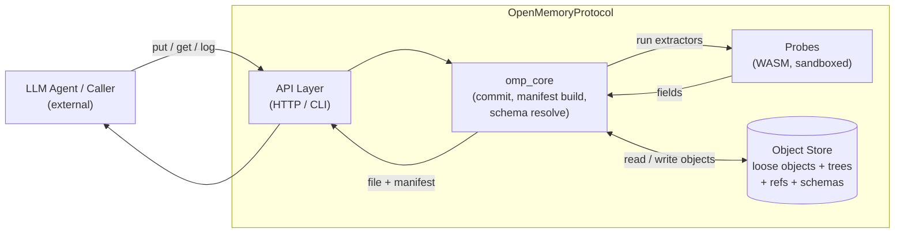

# OMP Architecture (High Level)

```mermaid
flowchart LR
    Caller["LLM Agent / Caller<br/>(external)"]

    subgraph OMP["OpenMemoryProtocol"]
        API["API Layer<br/>(HTTP / CLI)"]
        Core["omp_core<br/>(commit, manifest build,<br/>schema resolve)"]
        Probes["Probes<br/>(WASM, sandboxed)"]
        Store[("Object Store<br/>loose objects + trees<br/>+ refs + schemas")]
    end

    Caller -->|put / get / log| API
    API --> Core
    Core -->|run extractors| Probes
    Core <-->|read / write objects| Store
    Probes -->|fields| Core
    Core -->|file + manifest| API
    API --> Caller
```
