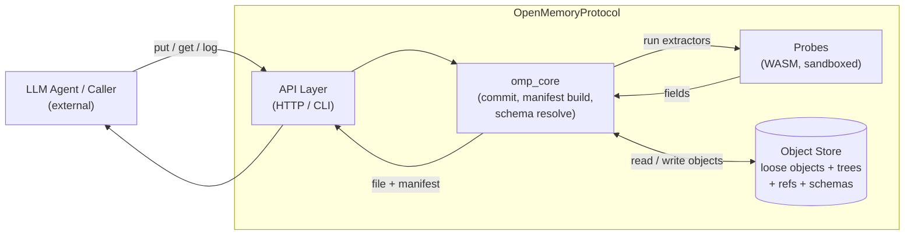

# OMP Architecture (High Level)

## What this shows

- **Caller** is anything outside OMP (an LLM agent, a script, a service). OMP itself never calls an LLM.
- **API Layer** is a thin wrapper — both HTTP and CLI dispatch into the same core.
- **omp_core** holds all the logic: hashing bytes, resolving the right schema version, building the manifest, writing commits.
- **Probes** are deterministic WASM modules that extract fields (e.g. `text.word_count`, `pdf.page_count`). They are content in the store, not built-in code.
- **Object Store** holds everything Git-style: blobs, trees, commits, refs, schemas, and probe binaries — all as content-addressed loose objects.

Every stored file ends up as `(bytes, manifest)` where the manifest is assembled from five field sources: `constant`, `probe`, `user_provided`, `field`, `fallback`.
