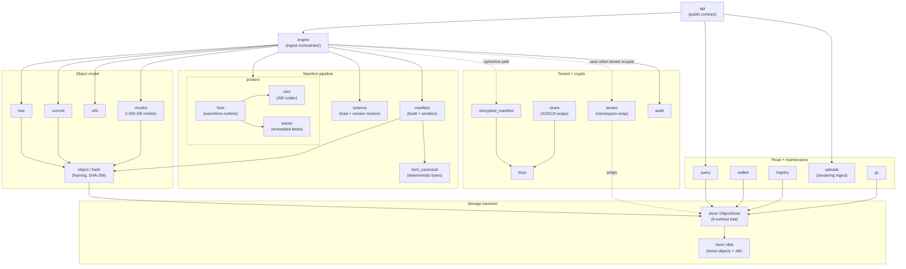

# omp_core Architecture (Medium Level)

Inside the `omp-core` crate. Modules are grouped by role; arrows show the dominant call direction during a `put` / `get`.

```mermaid
flowchart TB
    API["api<br/>(public contract)"]
    Engine["engine<br/>(ingest orchestrator)"]

    subgraph Manifest["Manifest pipeline"]
        Schema["schema<br/>(load + version resolve)"]
        ManifestMod["manifest<br/>(build + serialize)"]
        Canon["toml_canonical<br/>(deterministic bytes)"]
        subgraph ProbeHost["probes/"]
            PHost["host<br/>(wasmtime runtime)"]
            PCbor["cbor<br/>(ABI codec)"]
            PStarter["starter<br/>(embedded blobs)"]
        end
    end

    subgraph Objects["Object model"]
        Object["object / hash<br/>(framing, SHA-256)"]
        Tree["tree"]
        Commit["commit"]
        Refs["refs"]
        Chunks["chunks<br/>(>200 GB merkle)"]
    end

    subgraph Store["Storage backend"]
        StoreTrait["store::ObjectStore<br/>(9-method trait)"]
        Disk["store::disk<br/>(loose objects + zlib)"]
    end

    subgraph Security["Tenant + crypto"]
        Tenant["tenant<br/>(namespace wrap)"]
        Keys["keys"]
        EncMan["encrypted_manifest"]
        Share["share<br/>(X25519 wraps)"]
        Audit["audit"]
    end

    subgraph Read["Read + maintenance"]
        Query["query"]
        Walker["walker"]
        Registry["registry"]
        Uploads["uploads<br/>(streaming ingest)"]
        GC["gc"]
    end

    API --> Engine
    API --> Query
    API --> Uploads

    Engine --> Schema
    Engine --> ManifestMod
    Engine --> ProbeHost
    Engine --> Tree
    Engine --> Commit
    Engine --> Refs
    Engine --> Chunks
    Engine --> Audit

    ManifestMod --> Canon
    PHost --> PCbor
    PHost --> PStarter

    Tree --> Object
    Commit --> Object
    Chunks --> Object
    ManifestMod --> Object

    Object --> StoreTrait
    StoreTrait --> Disk

    Tenant -. wraps .-> StoreTrait
    EncMan --> Keys
    Share --> Keys
    Engine -. "uses when tenant scoped" .-> Tenant
    Engine -. "ciphertext path" .-> EncMan

    Query --> StoreTrait
    Walker --> StoreTrait
    Registry --> StoreTrait
    GC --> StoreTrait
```