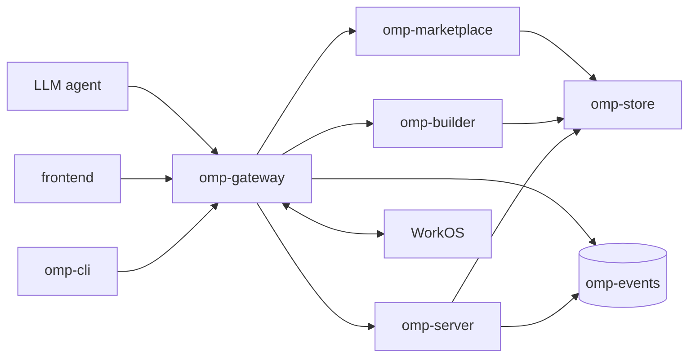

# OMP Microservices

```mermaid
flowchart LR
    CLI["omp-cli"]
    UI["frontend"]
    Agent["LLM agent"]

    GW["omp-gateway"]
    Server["omp-server"]
    Store["omp-store"]
    Builder["omp-builder"]
    Market["omp-marketplace"]

    Kafka[("omp-events")]
    WorkOS["WorkOS"]

    CLI --> GW
    UI --> GW
    Agent --> GW

    GW --> Server
    GW --> Builder
    GW --> Market
    GW <--> WorkOS

    Server --> Store
    Builder --> Store
    Market --> Store

    Server --> Kafka
    GW --> Kafka
```
